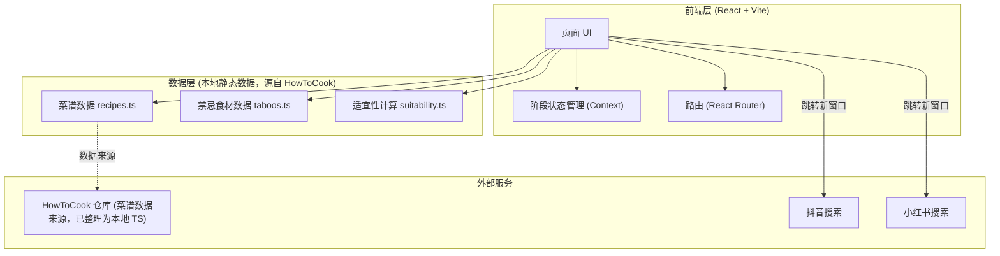
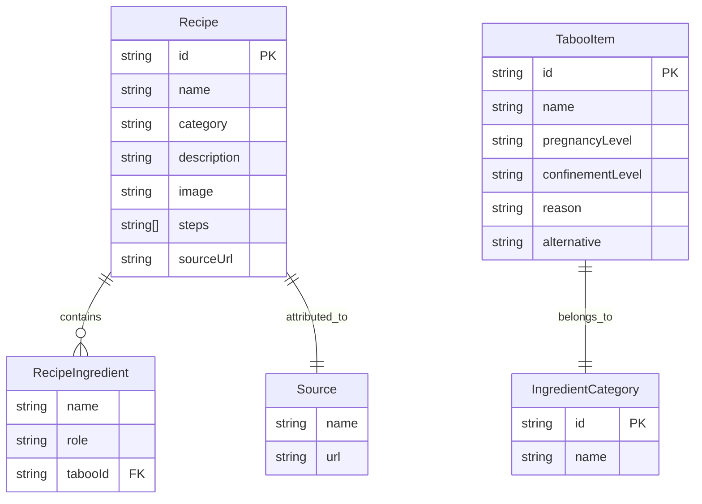

## 1. 架构设计



## 2. 技术说明
- **前端框架**：React@18 + TypeScript
- **构建工具**：Vite
- **样式方案**：TailwindCSS@3 + CSS 变量（暖色主题令牌）
- **路由**：React Router DOM@6
- **图标**：lucide-react
- **字体**：Google Fonts 引入 Noto Serif SC + Cormorant Garamond（标题）、Noto Sans SC（正文）
- **后端**：无（纯前端应用）
- **数据库**：无
- **数据来源与集成策略**：
  - 菜谱内容直接采用开源项目 [HowToCook](https://github.com/Anduin2017/HowToCook)（MIT 协议）。
  - HowToCook 仓库按 `dishes/{breakfast,staple,vegetarian_dish,meat_dish,soup,drink,dessert}/` 组织 markdown 菜谱。
  - 由于 HowToCook 仓库未提供稳定 CDN/JSON API 且运行时抓取 GitHub raw 存在 CORS 限制，采用**本地化整理**方案：选取 HowToCook 中代表性的菜谱，按其原始 markdown 内容（标题、原料、步骤）整理为本地 TypeScript 数据文件 `recipes.ts`，保留每道菜的 `sourceUrl` 指向原始 markdown，并在 UI 上标注 HowToCook 来源。
  - 禁忌数据 `taboos.ts` 基于公开母婴营养常识整理，独立于 HowToCook。
  - 适宜性由 `suitability.ts` 根据"菜谱食材 ∩ 当前阶段禁忌食材"实时计算得出，而非硬编码。

## 3. 路由定义
| 路由 | 用途 |
|------|------|
| `/` | 首页：阶段切换、今日安心推荐、安全等级过滤菜谱墙、分类导航、禁忌速查入口 |
| `/recipe/:id` | 菜谱详情页：安全结论卡、食材禁忌清单、做法、视频跳转 |
| `/taboos` | 禁忌速查页：按阶段+等级浏览禁忌食材全库 |

## 4. API 定义
无后端 API。前端通过本地数据文件直接消费。

## 5. 服务端架构
无后端服务。

## 6. 数据模型

### 6.1 数据模型定义



### 6.2 数据定义说明
- 安全等级枚举：`Level = "safe" | "caution" | "forbidden"`
- `TabooItem.pregnancyLevel` / `confinementLevel`：上述枚举，表示该食材在孕期 / 月子期的安全等级
- **菜谱适宜性计算规则**（在 `suitability.ts` 中实现）：
  - 取菜谱全部食材，匹配 `taboos` 中已知食材的安全等级；
  - 任一食材为 `forbidden` → 菜谱该阶段等级 = `forbidden`；
  - 任一食材为 `caution`（无 forbidden）→ 等级 = `caution`；
  - 其余 → `safe`；
  - 同时返回触发的禁忌食材列表，供详情页逐项标注与给出替代建议。
- HowToCook 分类映射（本地 `category` 字段）：
  - `breakfast`→早餐、`staple`→主食、`meat_dish`→荤菜、`vegetarian_dish`→素菜、`soup`→汤羹、`drink`→饮品、`dessert`→甜品

### 6.3 视频跳转链接构造
```ts
// 菜谱详情页与首页均可调用，菜名作为搜索关键词
const buildDouyinUrl = (name: string) =>
  `https://www.douyin.com/search/${encodeURIComponent(`${name} 做法`)}`;
const buildXhsUrl = (name: string) =>
  `https://www.xiaohongshu.com/search_result?keyword=${encodeURIComponent(`${name} 做法`)}`;
```
按钮以 `target="_blank"` 且 `rel="noopener noreferrer"` 新窗口打开。
